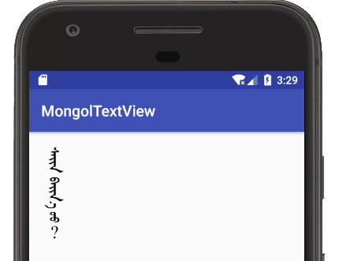
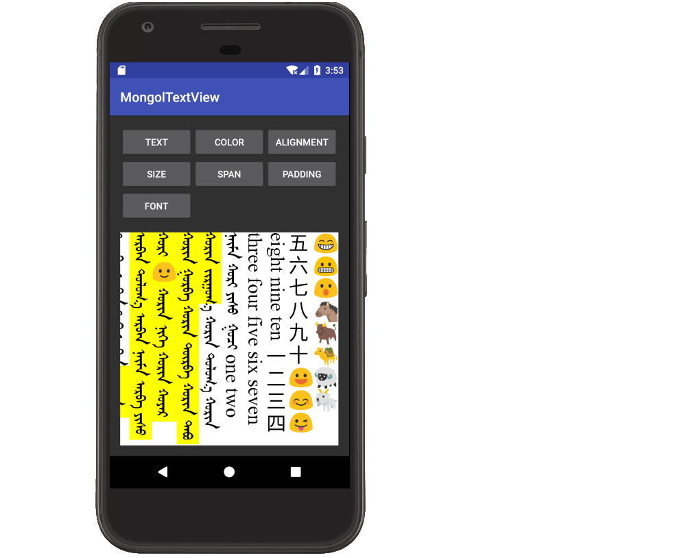
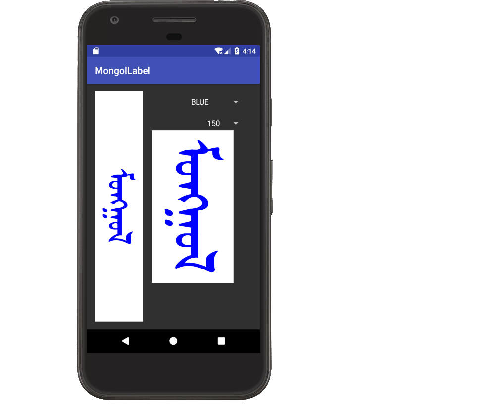
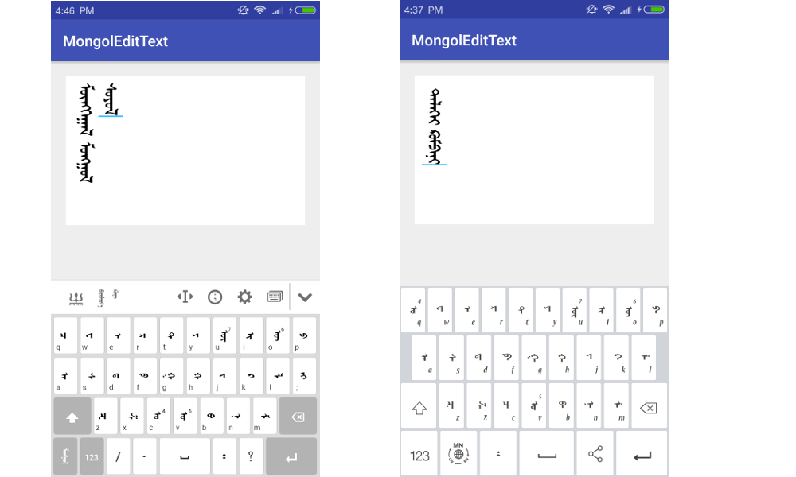
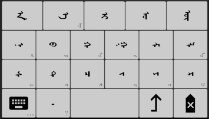
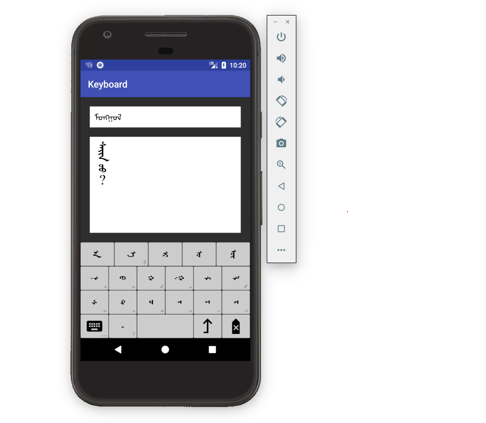
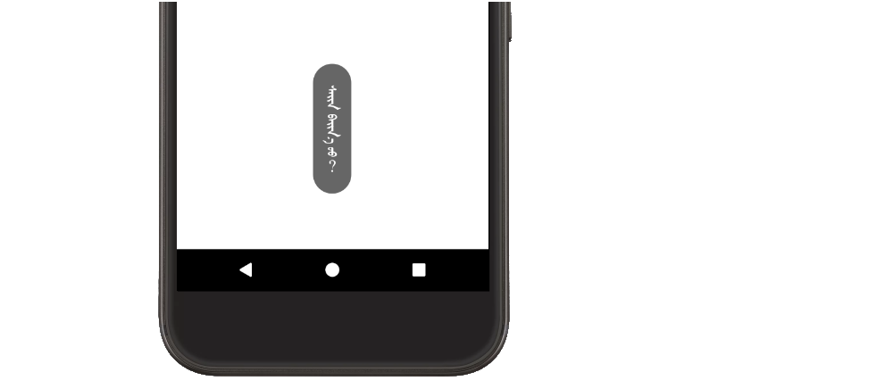
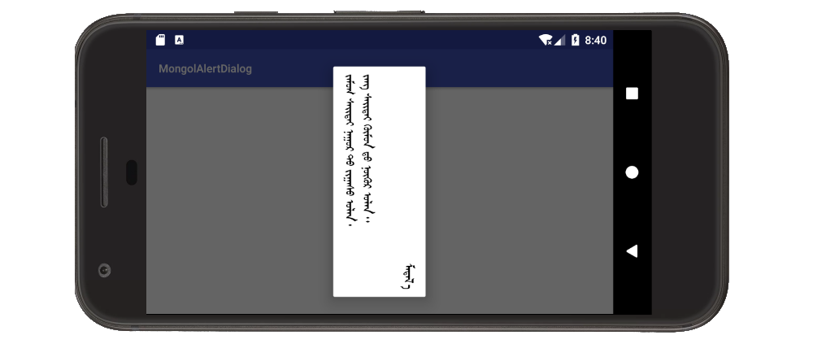
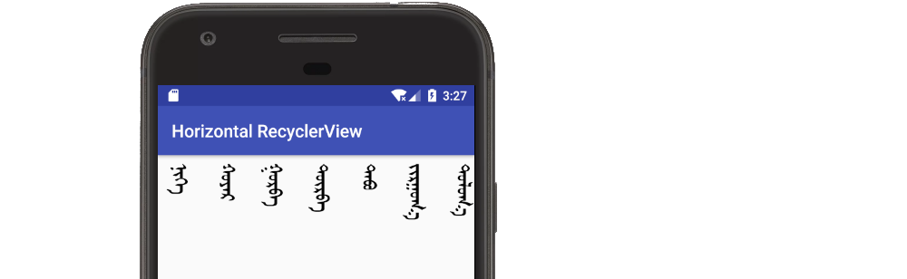
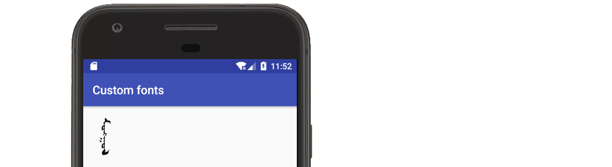

# Mongol Library

Android UI components for vertical Mongolian text 

## Table of Contents 

* [Introduction](https://github.com/suragch/mongol-library#introduction)
* [Installing](https://github.com/suragch/mongol-library#installing)
* [UI Componants](https://github.com/suragch/mongol-library#uicomponants)
    * [MongolTextView](https://github.com/suragch/mongol-library#mongoltextview) 
    * [MongolLabel](https://github.com/suragch/mongol-library#mongollabel)
    * [MongolEditText](https://github.com/suragch/mongol-library#mongoledittext)
    * [Keyboards](https://github.com/suragch/mongol-library#keyboard)
    * [MongolToast](https://github.com/suragch/mongol-library#mongoltoast)
    * [MongolAlertDialog](https://github.com/suragch/mongol-library#mongolalertdialog)
    * [Horizontal RecyclerView](https://github.com/suragch/mongol-library#horizontal-recyclerview)
    * [Deprecated views](https://github.com/suragch/mongol-library#deprecated-views)
* [Unicode](https://github.com/suragch/mongol-library#unicode)
* [Fonts](https://github.com/suragch/mongol-library#fonts)
* [How to contribute](https://github.com/suragch/mongol-library#how-to-contribute)
    * [TODO](https://github.com/suragch/mongol-library#todo)
    * [Version changes](https://github.com/suragch/mongol-library#version-changes)
* [External links](https://github.com/suragch/mongol-library#external-links)
* [Apps that use this library](https://github.com/suragch/mongol-library#apps-that-use-this-library)
 
## Introduction

This Android library is a collection of UI components that support vertical Mongolian text. 

All of the native Android UI components only support horizontal text. In addition to this, Android support for Mongolian Unicode rendering is inadequate. These challenges at a big hurdle for new Mongolian app developers to overcome. Most of the established Mongolian tech companies do not share their source code. While this is understandable since they must make a profit, new developers must reinvent all the basic UI text components from scratch. This makes the Mongolian app development process very slow. 

The purpose of this library is to make it easy to include vetical Mongolian Unicode text in your app. Developers can simply import the mongol-library module and then just focus on the content of their project.

Although this library is currently usable, there are still many improvements which need to be made. It is hoped that both novice and experienced developers will contribute with issue notifications and pull requests. Feel free to fork your own version, too. This library is desctibuted under the most permissive licence that I could find: the MIT licence. I believe that freely sharing information and source code will benefit everyone and help to make ancient Mongolian relevant in the modern world.
 
## Installing

This library is a part of the jCenter repository, which is the default in Android Studio. You should see this in your project's `build.gradle` file:

```java
repositories {
    jcenter()
}
```

You can import `mongol-library` into your project from jCenter by adding the following line to your dependencies in your app module's `build.gradle` file:

```java
dependencies {
    compile 'net.studymongolian:mongol-library:0.9.3'
}
```

Beginning with Android Studio 3.0, you should use `implementation` rather than `compile`.

```java
dependencies {
    implementation 'net.studymongolian:mongol-library:0.9.3'
}
```

#### Note

**The minimum SDK version for this library is 14.** So if you are supporting Android versions below API 14 (Android 4.0 Icecream Sandwich), then you won't be able to use this library. The reason this choice was made is because the support library for Android O will also only cover down to API 14. However, if you still want to support lower versions in your app, you can copy the source code from this library into your project. With a little bit of editing it shouldn't be too difficult to support down to API 9 or perhaps lower.

## UI Componants

The following are the primary UI componants in the library. If you don't understand how to use any of them, open an issue and I will improve the documentation. See also the [Demo App](../tree/master/demo-app). 

### MongolTextView 

The `MongolTextView` is a vertical text replacement for the standard Android `TextView`. It measures and lays out text from top to bottom and vertical lines are laid out from left to right. No mirroring is done internally so mirrored fonts are not required (if you want to add additional fonts). As much as possible the [API](https://github.com/suragch/mongol-library/blob/master/mongol-library/src/main/java/net/studymongolian/mongollibrary/MongolTextView.java) seeks to follow the standard `TextView` [API](https://developer.android.com/reference/android/widget/TextView.html).

#### Basic usage

You can create a `MongolTextView` exclusively in XML or in code.



XML example

```xml
<LinearLayout
    xmlns:android="http://schemas.android.com/apk/res/android"
    xmlns:app="http://schemas.android.com/apk/res-auto"
    android:layout_width="match_parent"
    android:layout_height="match_parent"
    android:padding="20dp">
    
    <net.studymongolian.mongollibrary.MongolTextView
        android:id="@+id/mongol_text_view_id"
        android:layout_height="wrap_content"
        android:layout_width="wrap_content"
        app:text="ᠰᠠᠢᠨ ᠪᠠᠢᠨ᠎ᠠ ᠤᠤ︖"
        app:textSize="24sp"
        app:textColor="@android:color/black"/>
    
</LinearLayout>
```

Code example

```java
public class MainActivity extends AppCompatActivity {

    @Override
    protected void onCreate(Bundle savedInstanceState) {
        super.onCreate(savedInstanceState);
        setContentView(R.layout.activity_main);

        MongolTextView mongolTextView = (MongolTextView) findViewById(R.id.mongol_text_view_id);
        mongolTextView.setText("ᠮᠣᠩᠭᠣᠯ");
        mongolTextView.setTextColor(Color.BLUE);
    }
}
```

#### Features

Other features of MongolTextView include the following:

* Text color
* Text size
* Font
* Alignment
* Padding
* Spans
    * Background color
    * Foreground color
    * Relative size
    * Typeface
    * Style
    * Subscript
    * (TODO underline)
* (TODO line spacing)
* Emoji support
* CJK orientation support
* Unicode support

These can be further explored with the [Demo App](demo-app).




### MongolLabel 

`MongolLabel` is a light weight view similar to `MongolTextView`. It is less expensive because it does not have to calculate multi-line, emoji rotation, or spans. If you need a large number of MongolTextViews and are experiencing performance problems, then this may be a solution.

Supports:

* Unicode 
* text color
* text size
* fonts (typeface)
* centered in view
* auto text resizing if font too big for view size

Does not support:

* multi-line text
* CJK/emoji rotation 
* text spans

Here is an image of the [Demo App](demo-app):




### MongolEditText 

The `MongolEditText` is a vertical text replacement for the standard Android `EditText`. As much as possible the [API](https://github.com/suragch/mongol-library/blob/master/mongol-library/src/main/java/net/studymongolian/mongollibrary/MongolEditText.java) seeks to follow the standard `EditText` [API](https://developer.android.com/reference/android/widget/EditText.html). It subclasses `MongolTextView`. In addition to allowing cursor location and text selection, it also adds the API elements needed to communicate with both custom in-app keyboards and system keyboards. 

#### Basic usage

The following image shows `MongolEditText` receiving text input from the Menksoft and Delehi system keyboards.



###### XML example

```xml
<RelativeLayout xmlns:android="http://schemas.android.com/apk/res/android"
                xmlns:app="http://schemas.android.com/apk/res-auto"
                android:layout_width="match_parent"
                android:layout_height="match_parent"
                android:padding="20dp">

    <HorizontalScrollView
        android:id="@+id/hsvEditTextContainer"
        android:layout_width="match_parent"
        android:layout_height="wrap_content"
        android:fillViewport="true">

        <net.studymongolian.mongollibrary.MongolEditText
            android:id="@+id/metExample"
            android:layout_width="wrap_content"
            android:layout_height="200dp"
            android:padding="10dp"
            android:background="@android:color/white"
            app:text=""
            app:textSize="30sp"/>

    </HorizontalScrollView>

</RelativeLayout>
```

Note that since `MongolEditText` does not support scrolling itself yet, it is good to wrap it in a `HorizontalScrollView`. 

###### Code example

```java
MongolEditText mongolEditText = (MongolEditText) findViewById(R.id.metExample);
String text = mongolEditText.getText().toString();
```

#### Features

* Accepts input from system keyboards and mongol-library keyboards. 
* text selection 
* highlight words on double click
* change selection on drag
* conforms to the Editable protocol 
* Unicode indexing (handles glyph indexing internally) 
* also supports Menksoft code

### Keyboard

It cannot be assumed that all users will have a Mongol IME (like the Menksoft or Delehi keyboards) installed on their phone, so if you need Mongolian input in your app, you should probably include an in-app keyboard. 

Currently only the AEIOU keyboard layout is finished, but a QWERTY layout will also be added. Additionally, Cyrillic and English keyboards will be added for convenient language switching options.



The philosophy behind the AEIOU keyboard is to make input as easy as possible. The general arrangement follows the order of the Mongolian alphabet. The buttons are large by making infrequently used letters only available as longpress popups. The Unicode distinctions between O/U, OE/UE, and T/D are hidden from the user. It has been reported that countryside Mongols who have less interaction with computer keyboards prefer this layout. Users who want more controll over the Unicode input characters can use the QWERTY keyboard layout when it is finished.

#### Basic usage

In the future keyboards will be wrapped in an `ImeContainer` to allow for keyboard switching and candidate word suggestions. However, since that functionality is not finished yet, this example shows how to just use a single keyboard (`KeyboardAeiou`) directly connected to a `MongolEditText`.

XML layout

```xml
<LinearLayout xmlns:android="http://schemas.android.com/apk/res/android"
              xmlns:app="http://schemas.android.com/apk/res-auto"
              android:layout_width="match_parent"
              android:layout_height="match_parent"
              android:orientation="vertical">

    <HorizontalScrollView
        android:id="@+id/hsvEditTextContainer"
        android:layout_width="match_parent"
        android:layout_height="0dp"
        android:layout_weight="0.5"
        android:layout_margin="20dp"
        android:fillViewport="true">

        <net.studymongolian.mongollibrary.MongolEditText
            android:id="@+id/mongoledittext"
            android:layout_width="wrap_content"
            android:layout_height="match_parent"
            android:padding="10dp"
            app:textSize="30sp"
            android:background="@android:color/white"/>

    </HorizontalScrollView>


    <net.studymongolian.mongollibrary.KeyboardAeiou
        android:id="@+id/keyboard_aeiou"
        android:layout_width="match_parent"
        android:layout_height="0dp"
        android:layout_weight="0.5"/>

</LinearLayout>
```

Code

```java
public class MainActivity extends AppCompatActivity {

    @Override
    protected void onCreate(Bundle savedInstanceState) {
        super.onCreate(savedInstanceState);
        setContentView(R.layout.activity_main);

        MongolEditText mongolEditText = (MongolEditText) findViewById(R.id.mongoledittext);
        KeyboardAeiou keyboard = (KeyboardAeiou) findViewById(R.id.keyboard_aeiou);

        // prevent system keyboard from appearing when MongolEditText is tapped
        mongolEditText.setAllowSystemKeyboard(false);

        // send the keyboard input to the MongolEditText
        InputConnection ic = mongolEditText.onCreateInputConnection(new EditorInfo());
        keyboard.setInputConnection(ic);

    }
}
```

This will produce the following setup.



### MongolToast 

`MongolToast` is a vertical version of Android `Toast`.

#### Basic usage

```java
MongolToast.makeText(getApplicationContext(), "ᠰᠠᠢᠨ ᠪᠠᠢᠨ᠎ᠠ ᠤᠤ︖", MongolToast.LENGTH_LONG).show();
```

This produces the following result:



### MongolAlertDialog

`MongolAlertDialog` is a vertical version of Android `AlertDialog`. It currently only supports a title, message, and up to 3 buttons. 

#### Basic usage

```java
// setup the alert builder
MongolAlertDialog.Builder builder = new MongolAlertDialog.Builder(this);
builder.setMessage("ᠵᠠᠮᠤᠭ ᠰᠠᠢᠲᠠᠢ ᠨᠠᠭᠤᠷ ᠲᠤ ᠵᠢᠭᠠᠰᠤ ᠤᠯᠠᠨ᠂\nᠵᠠᠩ ᠰᠠᠢᠲᠠᠢ ᠬᠦᠮᠦᠨ ᠳᠦ ᠨᠦᠬᠦᠷ ᠤᠯᠠᠨ᠃");

// add the button
builder.setPositiveButton("ᠮᠡᠳᠡᠯ᠎ᠡ", new DialogInterface.OnClickListener() {
    @Override
    public void onClick(DialogInterface dialog, int which) {
        // do sth
    }
});

// create and show the alert dialog
 MongolAlertDialog dialog = builder.create();
 dialog.show();
 ```

This produces the following result:



### Horizontal RecyclerView

No special UI componants are needed from the library to create a horizontal `RecyclerView`. However, it is a common need for Mongolian apps, so an example is included here.



The only thing you really need to do differently from a normal `RecyclerView` list is to use `LinearLayoutManager.HORIZONTAL` for the orientation. Check out [this Stack Overflow answer](https://stackoverflow.com/a/45953855/3681880) for more detailed instructions. 

Also see the example in the Demo App. Here is the relevant code:

* [HorizontalRecyclerViewActivity.java](https://github.com/suragch/mongol-library/blob/master/demo-app/src/main/java/net/studymongolian/mongollibrarydemo/HorizontalRecyclerViewActivity.java)
* [HorizontalRecyclerViewAdapter.java](https://github.com/suragch/mongol-library/blob/master/demo-app/src/main/java/net/studymongolian/mongollibrarydemo/HorizontalRecyclerViewAdapter.java)
* [activity_horizontal_recyclerview.xml](https://github.com/suragch/mongol-library/blob/master/demo-app/src/main/res/layout/activity_horizontal_recyclerview.xml)
* [horizontal_recyclerview_item.xml](https://github.com/suragch/mongol-library/blob/master/demo-app/src/main/res/layout/horizontal_recyclerview_item.xml)

### Deprecated views

In the past I displayed Mongolian by rotating and mirroring the standard Android views (mainly `TextView`). There are a number of disadvantages with this method, which is why I no longer do it. However, I am including the following two views (but omitting `RotatedEditText`) in the library. This is partly for historical/reference purposes and partly because they could be used if `MongolTextView` is lacking some fuctionality that you need. 

* [RotatedTextView](https://github.com/suragch/mongol-library/blob/master/mongol-library/src/main/java/net/studymongolian/mongollibrary/RotatedTextView.java)
* [RotatedViewGroup](https://github.com/suragch/mongol-library/blob/master/mongol-library/src/main/java/net/studymongolian/mongollibrary/RotatedViewGroup.java)

These views are deprecated. In the future they may be dropped from the library. If you plan to use them long term, it is recommended that you just copy the code into your project. 

Disadvantages of using these views:

* Since correct text orientation is achieved by rotating and mirroring the entire view, a vertically mirrored font must be used with them. This font is not included with this library. However, you may [download them from Menksoft](http://www.menksoft.com/site/alias__menkcms/2805/Default.aspx) (Choose the Photoshop mirrored fonts). 
* It is very difficult to disable the popup menu to replace it with a Mongolian one. (This was the primary reason that this library was started.) 
* Any glyphs not included in the mirrored font will be backwards. That includes all Chinese and other CJK characters. Also, emoji will not be correctly rotated. 

## Unicode 

All of the UI components in this library are designed to use Unicode for all input and output. (However, since glyph rendering internally uses Menksoft code, you can also use Menksoft code for input. This is not recommended, though.) 

The rendering engine conforms to the [Unicode 10.0 standard](http://unicode.org/versions/Unicode10.0.0/). However, the standard was deviated from in the following case:

* MONGOLIAN LETTER GA, second final form. The Unicode 10.0 standard second final form is the feminine form. However, there is no way to override a feminine GA in words like SHIG to make it masculine and the only solution is to explicitly specify a feminine GA in every single neuter word (example: BICHIG(FVS1)). However, none of the major font players do that ([source](https://r12a.github.io/mongolian-variants/#char182D)). They use FVS1 as a masculine override and FVS2 to specify the feminine form. This was also the proposal in [DS01](https://w3c.github.io/mlreq/variants/ds01.pdf). It is much more natural to default to a feminine final GA in neuter words and only override to a masculine GA when necessary. Thus, the rendering engine in this library also follows the DS01 recomendation for final GA.


###### Other issues

The Unicode standard does not specify how diphthongs should be encoded (or whether diphthongs exist at all in written Mongolian). For example, the AI of SAIN is sometimes encoded as AI (`\u1820\u1821`) and sometimes encoded as AYI (`\u1820\u1836\u1821`). For this reason, both of these encodings are supported. However, this creates a problem for rendering the AI of NAIMA (eight). To get around this difficulty, a `ZWJ` may be inserted between the A and I (`NA(ZWJ)IMA`). The same trick can be used to override the dotted N context in names like CHOLMONODO (CHOLMON(ZWJ)O(FVS1)DO). However, this is not a standard documented use of `ZWJ`. Therefore it is hoped that the Unicode standard will introduce an additional control character that could be used similarly to the FVS characters. This new control character would always override the context and make the default form be shown. (This would also solve the final GA problem discussed above.)

See the demo app or the tests for examples of how words are rendered. If you discover any rendering errors then please report them. This is a high priority issue. 

#### Code examples

The `MongolCode` class is the Unicode rendering engine. Generally you won't need to use this class directly, but you can use it to covert between Menksoft code and Unicode if needed. The `MongolCode.Uni` and `MongolCode.Suffix` inner classes may also be useful for references to get Unicode characters and strings. 

###### Unicode <--> Menksoft code conversion

```java
MongolCode converter = MongolCode.INSTANCE;
String unicode;
String menksoftCode;
        
// Unicode -> Menksoft code
unicode = "ᠮᠣᠩᠭᠣᠯ";
menksoftCode = converter.unicodeToMenksoft(unicode);
        
// Menksoft code -> Unicode
menksoftCode = "\uE2F2\uE289\uE2BC\uE2EC\uE289\uE2F9";
unicode = converter.menksoftToUnicode(menksoftCode);
```

###### Mongolian letters and suffixes

```java
char unicodeLetter = MongolCode.Uni.MA;                         // '\u182E'
char unicodePunctuation = MongolCode.Uni.MONGOLIAN_FULL_STOP;   // '\u1803'
String iyerSuffix = MongolCode.Suffix.IYER;                     // "\u202F\u1822\u1836\u1821\u1837"
```

###### Static classes

There are a number of static methods that are currently `private`. If these would be useful in other projects, then we could make them `public`. These are a sample:

* `boolean isMongolian(char character)`
* `boolean isConsonant(char character)`
* `boolean isVowel(char character)`
* `boolean isMasculineVowel(char character)`
* `boolean isFeminineVowel(char character)`
* `boolean isFVS(char character)`
* `boolean isMvsConsonant(char character)`
* `boolean isMenksoft(char character)`

TODO add Xinjiang Tod Mongol script support. 

## Fonts

In order to keep the library size as small as possible, only one font is included by default. This is the [Menksoft Qagan font](http://www.menksoft.com/mdls/am/amview.aspx?pid=0&alias=menkcms&iid=168137&mid=15302&wv=U). However, you may include any of the other [Menksoft fonts](http://www.menksoft.com/site/alias__menkcms/2805/Default.aspx) in your project. Either TrueType or OpenType are fine. In fact, the TrueType fonts are smaller and since the OpenType rendering code is not used in this library, the TrueType version of the font may be better when available. 

Some of the Menksoft fonts contain ligature errors for Latin letter combinations like `fi`. See [this Stack Overflow question](https://stackoverflow.com/questions/43315957/how-to-remove-ligatures-from-a-font-using-fontforge). It is hoped that Menksoft will correct these errors by removing the ligature encoding from the affected fonts. 

#### Code example

Use `MongolFont` to create a `TypeFace`. The `MongolFont` class will take care of caching fonts so that you can reuse them on multiple views. You should [create an assets folder](https://stackoverflow.com/questions/26706843/adding-an-assets-folder-in-android-studio) and add the Menksoft font that you want to use (optionally in a `fonts` subfolder).




```java
public class MainActivity extends AppCompatActivity {

    // custom font is stored in the app's assets/fonts folder
    public static final String AMGLANG = "fonts/MAM8102.ttf";

    @Override
    protected void onCreate(Bundle savedInstanceState) {
        super.onCreate(savedInstanceState);
        setContentView(R.layout.activity_main);
        
        MongolTextView mongolTextView = (MongolTextView) findViewById(R.id.mongol_text_view_id);
        mongolTextView.setText("ᠮᠣᠩᠭᠣᠯ");

        // set the custom font
        Typeface customFont = MongolFont.get(AMGLANG, getApplicationContext());
        mongolTextView.setTypeface(customFont);
    }
}
```

Custom fonts can also be added to spans.

## How to contribute 

For this library to be used widely, more testing and development is needed from other developers. 

If you find a bug, open an issue report. Even better would be to add a unit or instrumentation test that shows it. 

The following explanation shows how the library works internally. 

`MongolEditText` extends and adds editing functionality to `MongolTextView`, which itself directly extends View. `MongolTextView` uses `MongolCode` to convert the Unicode text into the Menksoft glyph text codes that are contained in the font. This text is then passed on to `MongolLayout`, which measures the text and breaks it into lines that are laid out vertically from left to right. Each line of text is drawn by `MongolTextLine`, which handles rotating emojis and CJK characters. A text run is the smallest string of characters that are processed together (for drawing or non-linebraking word units). 

`MongolEditText` communicates with the in-app keyboard using `MongolInputMethodManager`. The keyboards (both system and in-app) send input to the `MongolEditText` using `MetInputConnection`. 

The keyboards are embedded in the keyboard container, which acts as a controller switching between the in-app keyboards. It also handles communication with the candidate view (TODO). 

#### TODO 

* [ ] translate this documentation into Mongolian and Chinese
* [ ] `RecyclerView` example. 
* [ ] underline span 
* [ ] `MongolTextView` line spacing
* [ ] more `MongolAlertDialog` types (check box, radio button, list)
* [ ] add lots more jUnit and instrumentation tests 
* [ ] apply styly/theme colors to `MongolTextView`, `MongolLabel` and `MongolEditText` so that the default colors are correct for both light and dark themes.
* [ ] add MongolToolbar with vertical menu. (Toolbar can be vertical or horizontal orientation.)
* [ ] Remove AndroidManifest rtl support option. (But need to check how that affects applications that do support it.)

#### Version changes 

* `0.9.3`: `MongolEditText` crash fix, automatic keyboard switching
* `0.9.2`: Android Oreo updates. `MongolLabel` vertical auto-resizing bug fix
* `0.9.1`: Bug fix that was causing crashes for `setText` on `MongolEditText`
* `0.9.0`: Removed extra font and resource files to make as small as possible
* `0.8.2`: Updated to Unicode 10.0 

## External links 

* Groups
    * [Orhon open source community](http://www.openmgl.org/)
    * [Menksoft](http://www.menksoft.com/)
        * [fonts](http://www.menksoft.com/site/alias__menkcms/2805/Default.aspx)
    * [Inner Mongolia University](http://mglip.com/)
    * [Delehi](http://www.delehi.com)
    * [Almas](http://www.mongolfont.com/en/android/index.html)
* Unicode
    * [Unicode: Mongolian block](http://unicode.org/charts/PDF/U1800.pdf)
    * [Mongolian variant forms ](https://r12a.github.io/mongolian-variants/)
    * [DS01 document](https://w3c.github.io/mlreq/variants/ds01.pdf)
* Tools
    * [Code analyzer](http://r12a.github.io/apps/conversion/)
    * [Mongol online editor](http://mongol-bichig.top/editor)
    * [Unicode - Menksoft code online converter](http://mtg.mglip.com/)
    * [Cyrillic - Tradional script online converter](http://trans.mglip.com/)
    * [Code analyzer](http://r12a.github.io/apps/conversion/)

## Apps that use this library

* [Suryaa](https://github.com/suragch/Suryaa) 
