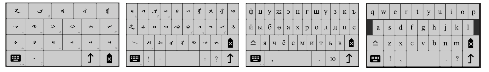

*中文不是我的母语，求读者纠正错误*

# mongol-library

[[English]](https://github.com/suragch/mongol-library/blob/master/README.md)

竖写蒙古文的Android控件库

## 目录

- [简介](https://github.com/suragch/mongol-library/blob/master/README.zh-Hans.md#%E7%AE%80%E4%BB%8B)
- [使用指南](https://github.com/suragch/mongol-library/blob/master/README.zh-Hans.md#%E4%BD%BF%E7%94%A8%E6%8C%87%E5%8D%97)
- 组件
    - [`MongolTextView` 蒙文文本框](https://github.com/suragch/mongol-library/blob/master/README.zh-Hans.md#mongoltextview)
    - [`MongolEditText` 蒙文编辑文本框](https://github.com/suragch/mongol-library/blob/master/README.zh-Hans.md#mongoledittext)
    - [`ImeContainer` 键盘包，输入法](https://github.com/suragch/mongol-library/blob/master/README.zh-Hans.md#imecontainer)
    - [`MongolMenu` 蒙文菜单](https://github.com/suragch/mongol-library/blob/master/README.zh-Hans.md#mongolmenu)
    - [`MongolAlertDialog` 蒙文对话框](https://github.com/suragch/mongol-library/blob/master/README.zh-Hans.md#mongolalertdialog)
    - [`MongolToast` 蒙文Toast提示框](https://github.com/suragch/mongol-library/blob/master/README.zh-Hans.md#mongoltoast)
- [`MongolCode` 蒙文国际编码处理器](https://github.com/suragch/mongol-library/blob/master/README.zh-Hans.md#mongolcode)
- [如何参与](https://github.com/suragch/mongol-library/blob/master/README.zh-Hans.md#%E5%A6%82%E4%BD%95%E5%8F%82%E4%B8%8E)
- [使用此库的应用](https://github.com/suragch/mongol-library/blob/master/README.zh-Hans.md#%E4%BD%BF%E7%94%A8%E6%AD%A4%E5%BA%93%E7%9A%84%E5%BA%94%E7%94%A8)

## 简介

此Android库让开发者在应用里轻松地使用竖写的蒙古文。组件包括文本框、编辑文本框、对话框、键盘等常用的文本控件。所有的控件都支持国际编码和蒙科立编码。

- [下载演示app体验以下](https://github.com/suragch/mongol-library/raw/master/demo-app/release/demo-app-release.apk)
- [浏览演示app源码](https://github.com/suragch/mongol-library/tree/master/demo-app/src/main)

## 使用指南

要求：

- Android Studio 3.0以上 （因为需要gradle和jcenter）
- 最低sdk版本(`minSdkVersion`)14以上

导入方式

在你的app模块的build.gradle文件里dependencies依赖项区加`mongol-library`的链接；

```java
dependencies {
    implementation 'net.studymongolian:mongol-library:1.12.1'
}
```

## `MongolTextView`

蒙文文本框


XML

```xml
<LinearLayout
    xmlns:android="http://schemas.android.com/apk/res/android"
    xmlns:app="http://schemas.android.com/apk/res-auto"
    android:layout_width="match_parent"
    android:layout_height="match_parent"
    android:padding="20dp">
    
    <net.studymongolian.mongollibrary.MongolTextView
        android:id="@+id/mongol_text_view_id"
        android:layout_height="wrap_content"
        android:layout_width="wrap_content"
        app:text="ᠰᠠᠢᠨ ᠪᠠᠢᠨ᠎ᠠ ᠤᠤ︖"
        app:textSize="24sp"
        app:textColor="@android:color/black"/>
    
</LinearLayout>
```

Java

```java
public class MainActivity extends AppCompatActivity {

    @Override
    protected void onCreate(Bundle savedInstanceState) {
        super.onCreate(savedInstanceState);
        setContentView(R.layout.activity_main);

        MongolTextView mongolTextView = findViewById(R.id.mongol_text_view_id);
        mongolTextView.setText("ᠮᠣᠩᠭᠣᠯ");
        mongolTextView.setTextColor(Color.BLUE);
    }
}
```

#### 备注

- 词库只包含蒙科立的[白体字库](http://www.menksoft.com/mdls/am/amview.aspx?pid=0&alias=menkcms&iid=168137&mid=15302&wv=U)。开发者可以自己添加更多字体：

```java
    String AMGLANG = "fonts/MAM8102.ttf";
    Typeface customFont = MongolFont.get(AMGLANG, getApplicationContext());
    mongolTextView.setTypeface(customFont);
```

- `MongolTextView`支持表情、中文、日文、韩文等文字的正确方向。


- 不需要任何文字转向或span格式的情况下，也可以用`MongolLabel`来代替。

## `MongolEditText` 

蒙文编辑文本框


`MongolEditText`支持系统键盘的输入，就像上面的图片所示。（蒙科立公司和德力海公司的第三方输入法）

XML

```xml
<HorizontalScrollView
    android:id="@+id/hsvEditTextContainer"
    android:layout_width="match_parent"
    android:layout_height="wrap_content"
    android:fillViewport="true">

    <net.studymongolian.mongollibrary.MongolEditText
        android:id="@+id/metExample"
        android:layout_width="wrap_content"
        android:layout_height="200dp"
        android:padding="10dp"
        android:background="@android:color/white"
        app:text=""
        app:textSize="30sp"/>

</HorizontalScrollView>
```

`MongolEditText`目前还不支持滚动，所以应该把它放在`HorizontalScrollView`里。

Java

```java
MongolEditText mongolEditText = findViewById(R.id.metExample);
String text = mongolEditText.getText().toString();
```

## `ImeContainer`

键盘包



`ImeContainer`的工作是管理键盘。此库有四种默认键盘布局，不是系统键盘，是可以嵌入到你的应用里。这样的话，如果用户没有安装第三方的蒙文输入法，还能用你给提供的键盘来输入蒙文。你还可以定制别的键盘布局，只需要复制键盘[源码](https://github.com/suragch/mongol-library/blob/master/mongol-library/src/main/java/net/studymongolian/mongollibrary/KeyboardQwerty.java)然后改一下，用法都一样。

XML

```xml
<?xml version="1.0" encoding="utf-8"?>
<RelativeLayout
    xmlns:android="http://schemas.android.com/apk/res/android"
    xmlns:app="http://schemas.android.com/apk/res-auto"
    xmlns:tools="http://schemas.android.com/tools"
    android:layout_width="match_parent"
    android:layout_height="match_parent">

    <HorizontalScrollView
        android:id="@+id/hsvEditTextContainer"
        android:layout_width="match_parent"
        android:layout_height="match_parent"
        android:layout_alignParentEnd="true"
        android:layout_alignParentRight="true"
        android:layout_alignParentTop="true"
        android:layout_above="@id/ime_container"
        android:layout_margin="16dp"
        android:fillViewport="true">

        <net.studymongolian.mongollibrary.MongolEditText
            android:id="@+id/mongoledittext"
            android:layout_width="wrap_content"
            android:layout_height="match_parent"
            android:background="@android:color/white"
            android:padding="10dp"
            app:textSize="30sp"
            tools:layout_editor_absoluteX="20dp"
            tools:layout_editor_absoluteY="128dp" />

    </HorizontalScrollView>

    <net.studymongolian.mongollibrary.ImeContainer
        android:id="@+id/ime_container"
        android:layout_width="match_parent"
        android:layout_height="250dp"
        android:background="#dbdbdb"
        android:layout_alignParentBottom="true"
        android:layout_alignParentStart="true"
        android:layout_alignParentEnd="true"
        android:layout_alignParentLeft="true"
        android:layout_alignParentRight="true">

        <net.studymongolian.mongollibrary.KeyboardQwerty
            android:layout_width="match_parent"
            android:layout_height="match_parent"
            style="@style/KeyboardTheme"
            />

        <net.studymongolian.mongollibrary.KeyboardAeiou
            android:layout_width="match_parent"
            android:layout_height="match_parent"
            app:primaryTextSize="30sp"
            style="@style/KeyboardTheme"
            />

    </net.studymongolian.mongollibrary.ImeContainer>

</RelativeLayout>
```

颜色、大小等各种方面都能调整：

```xml
<style name="KeyboardTheme" parent="AppTheme">
    <item name="keyColor">#ffffff</item>
    <item name="keyPressedColor">#b3b3b3</item>
    <item name="primaryTextColor">#000000</item>
    <item name="secondaryTextColor">#b3b3b3</item>
    <item name="keySpacing">3dp</item>
    <item name="keyBorderWidth">1px</item>
    <item name="keyBorderColor">#000000</item>
    <item name="keyBorderRadius">3dp</item>
    <item name="popupTextColor">#fe9a52</item>
    <item name="popupHighlightColor">#dbdbdb</item>
</style>
```

Java

```java
public class MainActivity extends AppCompatActivity {

    @Override
    protected void onCreate(Bundle savedInstanceState) {
        super.onCreate(savedInstanceState);
        setContentView(R.layout.activity_keyboard);

        ImeContainer imeContainer = findViewById(R.id.ime_container);
        EditText editText = findViewById(R.id.edittext);
        MongolEditText mongolEditText = findViewById(R.id.mongoledittext);

        // MongolInputMethodManager管理ImeContainer（键盘）和MongolEditText（或EditText）的交流
        MongolInputMethodManager mimm = new MongolInputMethodManager();
        mimm.addEditor(mongolEditText);
        mimm.setIme(imeContainer);
    }
}
```

#### 候选视图

`ImeContainer`也有候选视图，如果你有单词库的话，用户在输入的时候你可以提供候选词。


XML

```xml
<net.studymongolian.mongollibrary.KeyboardQwerty
    ...
    app:candidatesLocation="horizontal_top"
    ...
    />
    
<net.studymongolian.mongollibrary.KeyboardAeiou
    ...
    app:candidatesLocation="vertical_left"
    ...
    />
```

因为候选视图使用`RecyclerView`类，应用模块的build.gradle文件需要加`recyclerview`。

``` java
dependencies {
    implementation 'com.android.support:recyclerview-v7:27.1.1'
}
```

在AndroidManifest里的activity模块表示要隐藏系统键盘

```xml
android:windowSoftInputMode="stateHidden"
```

Java

```java
// 要声明ImeContainer.DataSource接口
public class MyActivity extends AppCompatActivity implements ImeContainer.DataSource, ImeContainer.OnNonSystemImeListener {

    @Override
    protected void onCreate(Bundle savedInstanceState) {
        // ...
       
        imeContainer.setDataSource(this);
        imeContainer.setOnNonSystemImeListener(this);
        // ...
    }

    // 实现ImeContainer.DataSource接口的方法

    @Override
    public void onRequestWordsStartingWith(String text) {
        // 候选试图要求以text开头的词
        // 然后更新imeContainer.setCandidates(wordList)
    }

    @Override
    public void onWordFinished(String word, String previousWord) {
        // 保存word
    }
    
    @Override
    public void onCandidateClick(int position, String word, String previousWordInEditor) {
        // 候选词被选上后候选试图要求接下来的词
        // 然后更新imeContainer.setCandidates(wordList)
    }

    @Override
    public void onCandidateLongClick(int position, String word, String previousWordInEditor) {
        // 候选词被长按
    }
    
    // 实现ImeContainer.OnNonSystemImeListener接口的方法
    
    @Override
    public void onHideKeyboardRequest() {
        // imeContainer.setVisibility(View.GONE)
    }
}
```

## `MongolMenu` 

蒙文菜单


Java

```java
MongolMenu menu = new MongolMenu(this);
menu.add(new MongolMenuItem("ᠨᠢᠭᠡ", R.drawable.ic_sun));
menu.add(new MongolMenuItem("ᠬᠤᠶᠠᠷ", R.drawable.ic_moon));
menu.add(new MongolMenuItem("ᠭᠤᠷᠪᠠ", R.drawable.ic_star));
menu.setOnMenuItemClickListener(new MongolMenu.OnMenuItemClickListener() {
    public boolean onMenuItemClick(MongolMenuItem item) {
        MongolToast.makeText(MongolMenuActivity.this, item.getTitle(), MongolToast.LENGTH_SHORT).show();
        return true;
    }
});
menu.showAsDropDown(view, 0, 0);
```

也可以用`showAtLocation`来代替`showAsDropDown`。

## `MongolAlertDialog` 

蒙文对话框


Java

```java
// setup the alert builder
MongolAlertDialog.Builder builder = new MongolAlertDialog.Builder(this);
builder.setMessage("ᠵᠠᠮᠤᠭ ᠰᠠᠢᠲᠠᠢ ᠨᠠᠭᠤᠷ ᠲᠤ ᠵᠢᠭᠠᠰᠤ ᠤᠯᠠᠨ᠂\nᠵᠠᠩ ᠰᠠᠢᠲᠠᠢ ᠬᠦᠮᠦᠨ ᠳᠦ ᠨᠦᠬᠦᠷ ᠤᠯᠠᠨ᠃");

// add the button
builder.setPositiveButton("ᠮᠡᠳᠡᠯ᠎ᠡ", new DialogInterface.OnClickListener() {
    @Override
    public void onClick(DialogInterface dialog, int which) {
        // do sth
    }
});

// create and show the alert dialog
 MongolAlertDialog dialog = builder.create();
 dialog.show();
 ```
 
 ## `MongolToast`
 
 蒙文Toast提示框
 


Java

```java
MongolToast.makeText(getApplicationContext(), "ᠰᠠᠢᠨ ᠪᠠᠢᠨ᠎ᠠ ᠤᠤ︖", MongolToast.LENGTH_LONG).show();
```

## `MongolCode`

蒙文国际编码处理器

#### Unicode

上面的控件都用`MongolCode`来处理国际编码并渲染文本，而不用字体的逻辑。此库在大多数情况下按照Unicode 10处理文本,但是有两个例外：

- Final MONGOLIAN LETTER GA + FVS1 and FVS2 (`\u182D` + `\u180B`/`\u180C`)， 跟大部分字体一样
- Medial MONGOLIAN LETTER I + FVS2 (`\u1822` + `\u180C`)， 跟蒙科立字体一样

双园音的两个写法都支持

- SAIN
- SAYIN

#### 编码转换

```java
MongolCode converter = MongolCode.INSTANCE;
String unicode;
String menksoftCode;
        
// 国际编码 -> 蒙科立编码
unicode = "ᠮᠣᠩᠭᠣᠯ";
menksoftCode = converter.unicodeToMenksoft(unicode);
        
// 蒙科立编码 -> 国际编码
menksoftCode = "\uE2F2\uE289\uE2BC\uE2EC\uE289\uE2F9";
unicode = converter.menksoftToUnicode(menksoftCode);
```

#### 静态字符和字符串

```java
char unicodeLetter = MongolCode.Uni.MA;                         // '\u182E'
char unicodePunctuation = MongolCode.Uni.MONGOLIAN_FULL_STOP;   // '\u1803'
String iyerSuffix = MongolCode.Suffix.IYER;                     // "\u202F\u1822\u1836\u1821\u1837"
```

#### 静态方法

* `boolean isMongolian(char character)`
* `boolean isConsonant(char character)`
* `boolean isVowel(char character)`
* `boolean isMasculineVowel(char character)`
* `boolean isFeminineVowel(char character)`
* `boolean isFVS(char character)`
* `boolean isMvsConsonant(char character)`
* `boolean isMenksoft(char character)`

## 如何参与

`mongol-library`还在开发中，虽然此版本已经比较稳定，知道的和不知道的故障都有，请大家原谅。如果你发现故障联系我，或者你自己修更好。如果有人想合作加新功能，下面有需要：

- 拼写正确的单词库
- `CheckBox`, `RadioButton`
- Android和junit自动化测试

## 使用此库的应用

- [Demo app 演示应用](https://github.com/suragch/mongol-library/tree/master/demo-app)
- [Suryaa 外语记忆卡篇](https://github.com/suragch/Suryaa) 
- [Todo 托忒输入法](https://github.com/suragch/TodoKeyboard)
- *加你的应用。。。*
